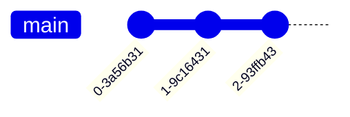

+++
title = "History"
date = 2022-07-26T16:13:48-04:00
+++

<ui5-timeline>
  <ui5-timeline-item id="410" title-text="410" icon="world">
    Romans pulled out of Britain.[^200623-1]  While Hadrian's wall isn't
    technically the furthest north they ever went, it seems to be the furthest
    consistently controlled, and probably represents the northern bounds of
    Christianity. Note, that bit about Christianity is pure speculation on my
    part.  Interestingly, the oldest known "split-nib metal dip pen" dates from
    around then.[^200816-1]   
  </ui5-timeline-item>
  <ui5-timeline-item id="800" title-text="800" icon="world">
    The Norse raiders imposed paganism in the areas they controlled, starting
    sometime around 800 through apparently the 10th century.[^200623-5] 
  </ui5-timeline-item>
</ui5-timeline>

[^200623-1]:  Last viewed 2020-06-23.

[^200816-1]:  Last Edited 2020-07-24. Last Viewed 2020-08-16

[^modeline]: # vim: shiftwidth=2:tabstop=2:expandtab 
