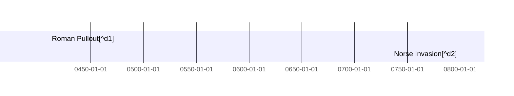

[^d1]: Romans pulled out of Britain.[^200623-1]  While Hadrian's wall isn't
    technically the furthest north they ever went, it seems to be the furthest
    consistently controlled, and probably represents the northern bounds of
    Christianity. Note, that bit about Christianity is pure speculation on my
    part.  Interestingly, the oldest known "split-nib metal dip pen" dates
    fromaround then.[^200816-1]   

[^d2]: The Norse raiders imposed paganism in the areas they controlled,
    starting sometime around 800 through apparently the 10th
    century.[^200623-5]

[^200623-1]:  Last viewed 2020-06-23.

[^200816-1]:  Last Edited 2020-07-24. Last Viewed 2020-08-16

[^modeline]: # vim: shiftwidth=2:tabstop=2:expandtab 

The  deals with self defense, citizens arrest, and similar matters that affect events and situations in the books. 
