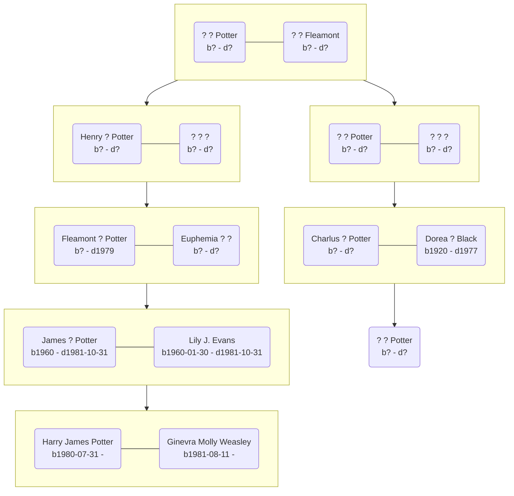

+++
title = "Members of the Potter Family"
type = "family"
date = 2022-02-05T04:27:33-05:00
weight = 5
+++

# Potter Family

This tree is speculative based on the available information.  Note that the
picture of the Potter family tree that is attributed to the Pottermore site has
a difference in line colour for the lines between the first two generations and
the lines between the latter, more certain generations.[^211009-1]  Charlus
Potter is placed based on Dorea Potter's birthday, and Henry Potter's dates of
service in the Wizengamot.  It is unlikely that Henry's child's wife was born as
Henry retired from public service.  It is more likely that his term in the
Wizengamot came in recognition for success in some prior career and thus later
in life, after his child(ren) are/were born. Since that pushes the connection up
a generation, I'm inserting a missing couple between Henry's mum (whose last
name was Fleamont) and Charlus (who had to be young enough to marry Dorea).
Sure marriages happen with mismatched ages, but I think most witches and wizards
marry right out of Hogwarts.  I have no real basis for that belief, the Weasley
children contradict it, but I think it fits the culture I am envisioning.

It is worth noting that the family tree developed on the Harry Potter fandom
wiki disagrees with the placement for Charlus Potter.[^210303-1]

There is another possibility to consider.  It is quite a coincidence that the
Potters would happen to have someone on the Wizengamot to debate the Statute of
Secrecy and World War I.   This is especially true if you consider that Henry
was part of the Wizengamot for a year before the war.[^210517-12] It is possible
that the Wizengamot is in fact hereditary, but that most Potters appoint
proxies, preferring to remain uninvolved in politics.[^210517-13]  This theory
is rather a stretch though.

[^210517-13]: Mrs. J. K. Rowling.
    "[The Potter Family](https://www.wizardingworld.com/writing-by-jk-rowling/the-potter-family)"
    Originally published on Pottermore on 2015-09-21. Last Viewed: 2021-05-17.
    The page states that "a member of the family has twice sat on the
    Wizengamot."

[^210517-12]: See my notes on [[History]]

[^211009-1]: [Harry Potter Wiki](https://harrypotter.fandom.com/)
    "[Potter family](https://harrypotter.fandom.com/wiki/Potter_family)"
    [Family Tree](https://harrypotter.fandom.com/wiki/Potter_family#Family_tree)
    Last edit 2021-02-20.  Last Viewed 2021-10-09.

[^210303-1]: [Harry Potter Wiki](https://harrypotter.fandom.com/)
    "[Potter family](https://harrypotter.fandom.com/wiki/Potter_family)"
    [Family Tree](https://harrypotter.fandom.com/wiki/Potter_family#Family_tree)
    Last edit 2021-02-20.  Last Viewed 2021-03-03.

